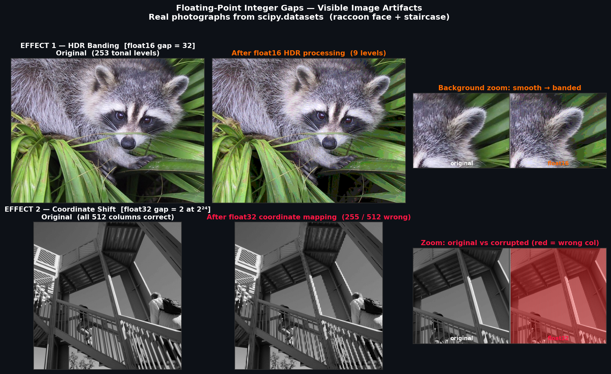
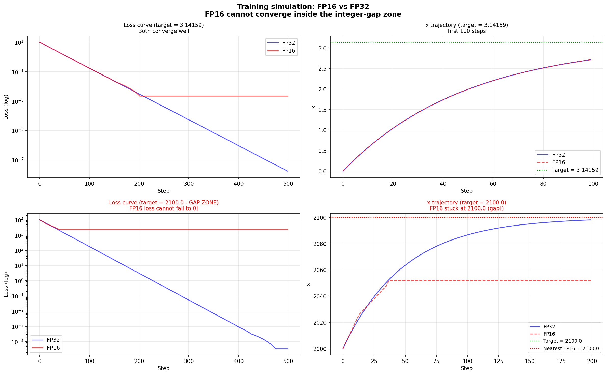
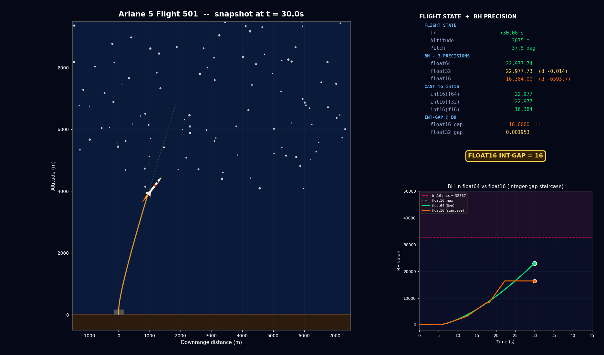

# Integer Gaps in Floating-Point Numbers — Demo Collection

Four standalone demos showing how the finite precision of IEEE 754
floating-point creates **integer gaps** that cause real, measurable failures.

---

## Quick setup (applies to all 4 projects)

```bash
cd <project-folder>

# 1. create virtual environment
python -m venv .venv          # Windows
python3 -m venv .venv         # Linux / macOS

# 2. activate
source .venv/Scripts/activate      # Windows Git Bash
.venv\Scripts\Activate.ps1         # Windows PowerShell
source .venv/bin/activate          # Linux / macOS

# 3. install
pip install -r requirements.txt

# 4. run
PYTHONIOENCODING=utf-8 python <script>.py
```

---

## 1 · Image Processing — `image_processing/`

**Script:** `demo_image_artifacts_real.py`  
**Run:** `python demo_image_artifacts_real.py`

Two real photographs (raccoon face + staircase) show two distinct artifacts:

| Effect | Root cause | Result |
|--------|-----------|--------|
| HDR Banding | float16 gap = 32 at offset 32768 | 253 tonal levels → 9 |
| Coordinate shift | float32 gap = 2 at offset 2²⁴ | 50% of columns mapped wrong |



---

## 2 · Machine Learning — `machine_learning/`

**Script:** `demo_machine_learning.py`  
**Run:** `python demo_machine_learning.py`

Gradient descent on `f(x) = (x − target)²` in FP16 vs FP32.
When the target sits inside a float16 integer gap (`target = 2100`, gap = 2),
FP16 **never converges** regardless of how many steps are run.



---

## 3 · Navigation & Robotics — `navigation_robotics/`

**Script:** `demo_navigation_robotics.py`  
**Run:** `python demo_navigation_robotics.py`

Reproduction of the **Patriot Missile bug (Feb 25, 1991)**.

The system tracked time with a **24-bit signed fixed-point register**.  
`0.1` truncated to 23 fraction bits = `838860 / 2²³ = 0.09999990…`  
Error per tick: `9.54 × 10⁻⁸ s` → after 100 h: **0.343 s → 575 m miss**.

> float32 is NOT the bug — float32 rounds `0.1` *up* (opposite sign).


---

## 4 · Ariane 5 Disaster — `ariane5_disaster/`

**Script:** `simulate_ariane5.py`  
**Run:** `python simulate_ariane5.py --save-gif`

Animated simulation of **Ariane 5 Flight 501 (June 4, 1996)**.  
Computes horizontal velocity `BH` simultaneously in float64 / float32 / float16:

- **float16** staircases and freezes at 16,384 (gap = 16 absorbs increments)
- **float64 BH** crosses int16 max at t = 36.7 s → uncaught Operand Error → explosion




---

## Core concept

For an IEEE float with *m* mantissa bits, consecutive representable integers
exist only up to `2^m`.  Beyond that threshold, the **gap doubles** every power
of two:

| Format | Mantissa bits | Exact up to | Gap at 2× threshold |
|--------|---------------|-------------|---------------------|
| float16 | 10 | 2,048 | 2 (then 4, 8, 16…) |
| float32 | 23 | 16,777,216 | 2 (then 4, 8…) |
| float64 | 52 | 9 × 10¹⁵ | negligible in practice |

Each demo targets a different **consequence** of this gap:
values cannot be stored, accumulated, cast, or converged to correctly.
